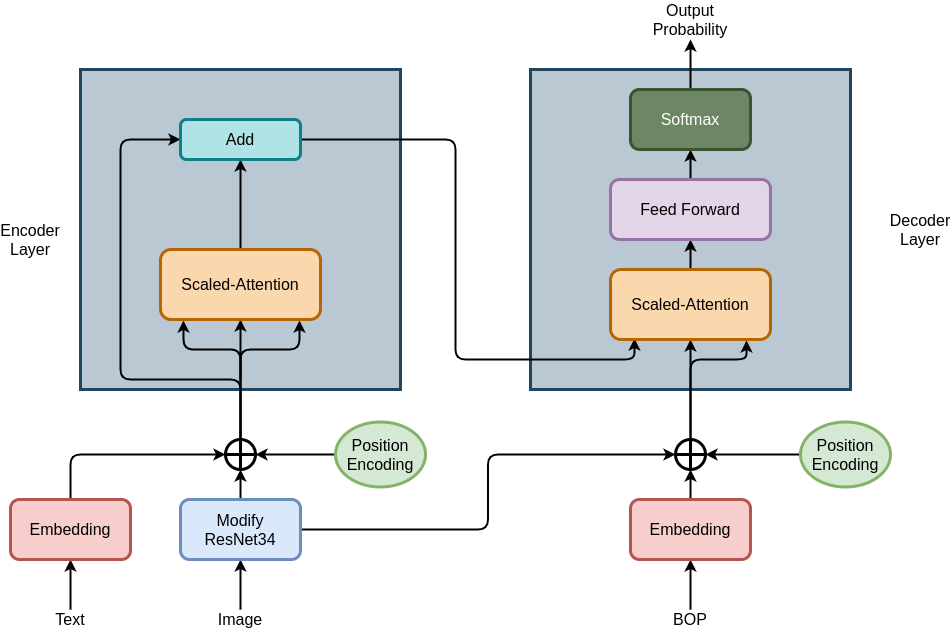
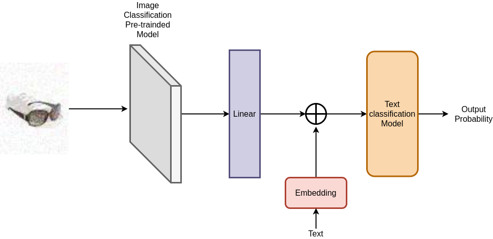

# cs480-680-kaggle
The code and model details in the cs480/680 kaggle competition at Fall 2020

In this task, I was inspired by [Transformer](https://arxiv.org/pdf/1706.03762.pdf), and thus I proposed a SimpleTransformer in this competition. The model architecture is in the following.

The BOP is Beginning of Prediction.

The another type of model also combined noisy image and text. The following figure displays the structure of this type of model.

For Pretrained Image classification I used [VGG](https://arxiv.org/pdf/1409.1556.pdf) and [MobileNet](https://arxiv.org/pdf/1704.04861.pdf). I implemented two text classification models: [TextCNN](https://arxiv.org/pdf/1408.5882.pdf) and [RCNN](http://zhengyima.com/my/pdfs/Textrcnn.pdf).

All these three models achieved over 97.8% in my validation set. More details can be checked in the notebook.
